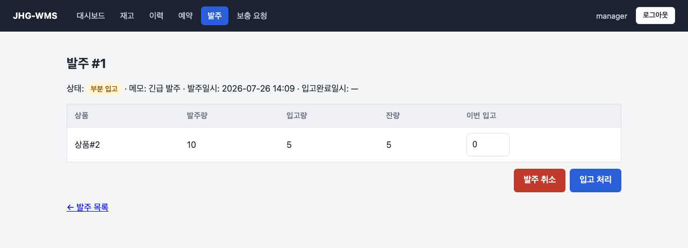
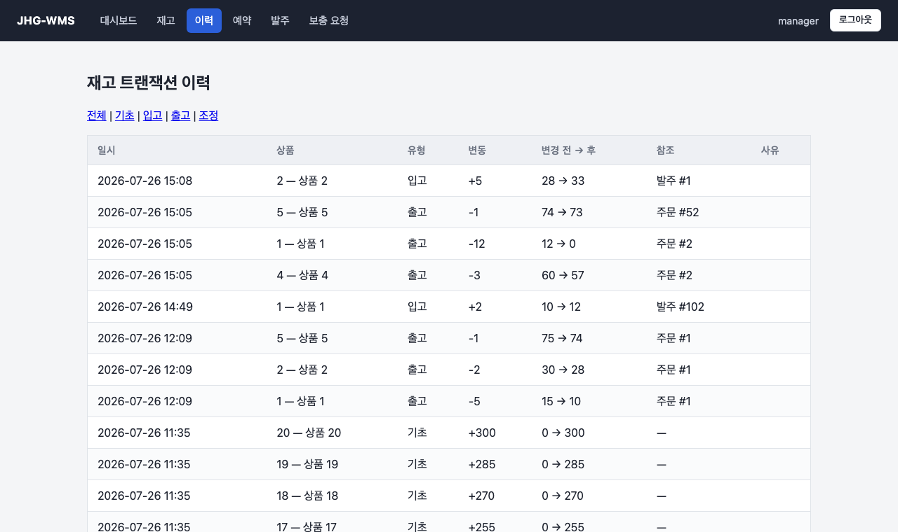
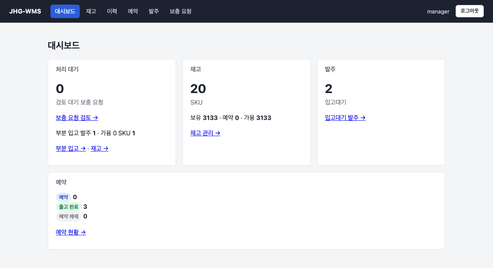

# JHG-WMS

[](https://github.com/twin10240/jhg-wms-project/actions/workflows/ci.yml)

**주문 시스템과 창고 시스템을 물리적으로 분리하고, 그 사이에서 재고 정합성을 지키는 WMS입니다.**

주문(OMS)과 재고(WMS)를 별개 애플리케이션·별개 DB로 나누면 "재고가 몇 개인가"라는 질문에 두 개의 답이 생길 위험이 따라옵니다. 이 프로젝트는 **재고의 정본을 WMS 한 곳에 두고**, OMS는 그 재고를 실시간으로 조회·차감하기만 하도록 경계를 그었습니다. 그리고 그 경계 위에서 **예약 모델**(가용 = 실물 − 예약)로 오버셀을 막고, **모든 재고 이동을 원장에 남겨** "이 수량이 왜 이렇게 됐는지"를 역추적할 수 있게 했습니다.

핵심은 **상대 시스템이 죽어도 재고 데이터가 오염되지 않는 것**입니다 → [회복탄력성](#회복탄력성--상대가-죽어도-재고는-오염되지-않는다)

| | |
|---|---|
| 통신 채널 | 5개 (조회 · 이행 · 통지 · 보상 · 반품 결과) |
| 재고 원장 | `OPENING / RECEIVE / SHIP / ADJUST / RETURN / COUNT` — 불변식 Σdelta == onHand, 행위자 기록 |
| 접근제어 | 폼 로그인 + `OPERATOR`/`MANAGER` 롤, `/api`는 서비스 계정 Basic |
| 테스트 | 359개 (도메인 · 서비스 · MockMvc 슬라이스 · 실서블릿 보안 통합 · **실제 동시 요청 경합**) |

> 📄 **[프로젝트 포트폴리오](docs/portfolio/portfolio.html)** — 두 시스템을 나눈 배경, 설계 결정 3가지, 동작 흐름(화면 캡처), 회복탄력성·인프라, 겪은 문제와 고도화 전략을 한 문서로 정리했습니다.
> GitHub은 HTML을 렌더링하지 않으니, 파일을 내려받아 브라우저로 열어보세요.

## 화면

**발주 상세 — 부분 입고와 취소**



한 발주를 여러 번에 나눠 입고합니다. 발주량 10 중 5가 들어와 `부분 입고` 상태이고, 잔량 5가 남아 있습니다. 잔량을 영영 못 받는 발주는 **MANAGER가 취소**해 닫으며, 이미 입고된 5개는 실물이므로 재고에서 되돌리지 않습니다. (두 버튼은 `MANAGER`로 로그인했을 때만 보입니다 — `OPERATOR`에게는 입고만 노출)

**재고 트랜잭션 이력 — 감사 추적**



모든 재고 이동이 원장 한 행으로 남습니다. **변경 전 → 후** 수량과 **참조**(`발주 #1`, `주문 #52`)가 함께 기록돼 "이 수량이 왜 이렇게 됐는지"를 역추적할 수 있습니다. 재고 변경 경로가 `InventoryService.applyDelta` 한 곳으로 모이므로 원장 누락이 구조적으로 발생하지 않습니다.

**대시보드 — 처리 대기 우선**



로그인 직후 "지금 처리할 일"(검토 대기 보충 요청 · 부분 입고 발주 · 가용 0 SKU)을 먼저 보여주고, 각 숫자는 해당 필터 목록으로 이어집니다.

<details>
<summary>로그인 화면</summary>


관리자 화면은 폼 로그인(DB 유저 + `OPERATOR`/`MANAGER` 롤), `/api/**`는 서비스 계정 Basic으로 분리돼 있습니다.
</details>

## OMS ↔ WMS 책임 경계

**주문(OMS)** 과 **창고(WMS)** 를 물리적으로 분리된 두 앱으로 나누고, 서로 직접 의존하지 않고 **REST 계약**으로만 통신합니다. 재고의 정본(source of truth)은 WMS 한 곳입니다.

| | OMS (jhg-commerce, :8080) | WMS (이 저장소, :8081) |
|---|---|---|
| 소유 도메인 | 주문·장바구니·고객·판매, 백오더 | 재고 수량·예약·발주(PO)·입고·재고 원장 |
| 재고에 대해 | 조회(실시간 질의) + "보충해줘" 요청 | 재고 정본. 수동 조정·발주·입고·요청 승인 |
| 관리자 권한 | 재고 조정·발주·입고 **없음**(설계상 제거) | 위 전부 소유 (OPERATOR/MANAGER 롤) |
| DB | 주문·고객 (재고 수량 없음) | 재고·예약·발주·원장 |

**OMS는 재고 수량을 저장하지 않습니다.** 필요할 때마다 WMS에 HTTP로 조회/차감하므로 어긋날 사본이 없습니다(미러 아님 — 라이브 리드).

### 통신 채널 (서비스 계정 Basic 인증)

| 채널 | 방향 | 용도 |
|------|------|------|
| S1 | OMS → WMS | 가용수량 조회 `GET /api/inventory/availability` |
| S2 | OMS → WMS | 주문 이행 `reserve` / `ship` / `release` |
| S3 | WMS → OMS | 재고 증가(입고·조정) 통지 → OMS 백오더 FIFO 승격 |
| S4 | 양방향 | 회복탄력성 — 타임아웃 · best-effort · 보상 스윕 |
| S5 | 양방향 | 반품(RMA) — OMS가 접수 `POST /api/returns`, WMS가 입고·검수 결과 통지 `POST /api/return-status-events` |
| S6 | WMS → OMS | 배송 완료 통지 `POST /api/delivery-events` — 창고가 기록하면 OMS 주문이 `DELIVERED`로 전이 |
| S7 | OMS → WMS | 송장 조회 `GET /api/shipments/{orderId}` — OMS가 자기 송장·배송 상태의 불일치를 확인·복구 |

보충 흐름: OMS가 백오더로 부족을 감지 → WMS에 **보충 요청** → WMS 관리자가 **승인 → 발주 생성 → 입고** → 재고 증가 → S3로 OMS에 통지 → OMS가 백오더 승격. (상세: 아래 [보충 요청과 발주](#보충-요청과-발주) · [OMS 재고보충 통지](#oms-재고보충-통지-s3-채널3) 절)

> 핵심: **"몇 개 있냐"는 오직 WMS.** OMS는 그 재고를 실시간으로 조회·차감할 뿐 자기 수량을 갖지 않는다. WMS가 응답하지 않으면 OMS는 가용수량 0으로 폴백해 무너지지 않고, 주문은 `재고 확인 중`으로 대기했다가 WMS 복구 후 예약된다 — 재고 정본을 한 곳에 두면서 그 의존이 끊겨도 견디도록 설계.

## 스택

| 항목 | 내용 |
|------|------|
| Java | 21 |
| Spring Boot | 3.5.5 |
| JPA / Hibernate | Spring Data JPA |
| DB | PostgreSQL (OMS와 물리 분리) |
| 빌드 | Gradle |

## 실행

PostgreSQL을 먼저 띄운 뒤 애플리케이션을 실행합니다(로컬은 Homebrew — 이 저장소는 Docker를 쓰지 않습니다).

```bash
# PostgreSQL 기동 (최초 1회: createuser/createdb로 롤 wms, DB wms·wms_test 준비)
brew services start postgresql@17

# WMS 실행 (포트 8081 — OMS가 8080 사용)
./gradlew bootRun

# 스키마 리셋이 필요할 때
./gradlew bootRun --args='--spring.profiles.active=local'
```

DB 접속: `psql -U wms -d wms`

JDBC URL: `jdbc:postgresql://localhost:5432/wms` (테스트는 `wms_test`)

### 로컬 계정 (기동 시 자동 시드)

| 구분 | 계정 | 용도 |
|------|------|------|
| 관리자(MANAGER) | `manager` / `manager` | 폼 로그인 — 발주 생성·취소, 보충요청 승인·반려, 반품 입고·검수·취소 포함 전 기능 |
| 운영자(OPERATOR) | `operator` / `operator` | 폼 로그인 — 조회·재고 조정·발주 입고 |
| 서비스 계정 | `wms` / `wms` | `/api/**` HTTP Basic — OMS 서버간 호출 전용(사람 로그인 아님) |

로그인 페이지는 `http://localhost:8081/login`. 운영에서는 셋 다 환경변수로 주입하며, 비어 있으면 기동이 실패합니다(fail-fast).

## 운영 배포 (Railway)

> 배포 설정과 과거 운영 검증 기록은 보존돼 있지만 **현재 Railway 서비스는 중단 상태**입니다.

- Dockerfile(멀티스테이지 JDK21) 존재 시 Railway가 자동 사용. `.dockerignore`로 build/·.git/ 제외.
- `prod` 프로파일: PostgreSQL(PG* 변수), `ddl-auto: update`. 빈 DB면 `InitDb`가 재고 1~20 시드.
- Variables:
  - `SPRING_PROFILES_ACTIVE=prod`, `PORT=8081`(private networking 주소 고정용), `OMS_BASE_URL=http://<oms>.railway.internal:8080`
  - `WMS_BASIC_USER`/`WMS_BASIC_PASSWORD` — `/api/**` 서비스 계정. **OMS 서비스에도 동일 값 필수**
  - `WMS_OPERATOR_USER`/`WMS_OPERATOR_PASSWORD`, `WMS_MANAGER_USER`/`WMS_MANAGER_PASSWORD` — 관리자 폼 로그인 계정 시드
  - `OMS_CALLBACK_USER`/`OMS_CALLBACK_PASSWORD` — WMS→OMS 재고보충 통지(S3)용. **OMS 서비스에도 동일 값 필수**
- **prod는 위 자격증명에 기본값이 없습니다** — 누락·공백이면 기동이 실패합니다(운영에서 `wms/wms` 같은 기본값으로 조용히 뜨는 것을 차단).
- 재배포 시 공개 도메인의 관리자 화면은 폼 로그인, `/api/**`는 Basic을 사용한다.
  OMS↔WMS는 private networking(`WMS_BASE_URL`/`OMS_BASE_URL`)으로 통신한다.
- 주의: `org.gradle.java.home`은 레포 `gradle.properties`에 커밋 금지(Windows 경로가 컨테이너 빌드를 죽임) — 머신 로컬 `~/.gradle/gradle.properties`에서 지정한다.

## API

### 재고 조회

| Method | URL | 설명 |
|--------|-----|------|
| GET | `/api/inventory/availability?productIds=1,2,3` | 가용수량 맵 반환 (OMS 채널1 연동) |
| GET | `/api/inventory/rows` | 전체 재고 목록 (관리자) |
| GET | `/api/shipments/{orderId}` | 송장·배송 상태 조회 (읽기 전용) |

### 주문 이행 재고 쓰기

| Method | URL | Body | 설명 |
|--------|-----|------|------|
| POST | `/api/inventory/reserve` | `{"orderId":1,"items":{"1":3,"2":1}}` | 예약 (멱등) |
| POST | `/api/inventory/ship` | `{"orderId":1,"items":{"1":3,"2":1}}` | 출고 |
| POST | `/api/inventory/release` | `{"orderId":1,"items":{"1":3,"2":1}}` | 예약 해제 |

#### 출고 응답 — 송장 (V3.1)

출고가 성공하면 WMS가 데모용 송장을 발급하고 다음을 반환합니다. 현재 `MOCK` 택배사만 지원합니다.

```json
{
  "orderId": 202,
  "carrierCode": "MOCK",
  "carrierName": "테스트택배",
  "trackingNumber": "MOCK-202-20260827063000",
  "issuedAt": "2026-08-27T06:30:00.123456Z"
}
```

- **송장번호 규칙**: `MOCK-{orderId}-{yyyyMMddHHmmss}`. 시각은 **UTC**이며 `issuedAt`과 같은 순간(초 단위)입니다.
- **주문당 1건**: `Reservation`이 주문당 1행이라 송장도 하나뿐입니다. 재호출해도 재고를 다시 깎지 않고
  송장도 재발급하지 않으며, **최초에 발급한 같은 송장을 반환**합니다.
- **이 기능 이전에 출고된 주문**은 송장이 없습니다. 재호출하면 재고는 그대로 두고 송장만 발급합니다.
- **`trackingNumber`를 키로 쓰지 마세요.** 발급 시각이 들어가므로 WMS DB가 초기화되면 같은 주문이
  다른 번호를 받습니다. **상관관계는 `orderId`로** 잡고 `trackingNumber`는 표시용으로 저장하세요.
- `status` 필드는 없습니다 — 성공 응답은 항상 `SHIPPED`이고 나머지는 HTTP 오류입니다.
- **`issuedAt`은 초 미만(마이크로초) 정밀도를 가집니다** — 실제 값은 `Instant.now()`에서 만들어지고
  DB `timestamp(6)`을 그대로 왕복합니다. 위 예시의 `.123456`처럼 소수점 이하 자릿수가 매번 달라지므로,
  `SimpleDateFormat("yyyy-MM-dd'T'HH:mm:ss'Z'")` 같은 초 단위 고정 패턴으로 파싱하지 말고
  `Instant.parse` 등 ISO-8601 instant 파서를 쓰세요.

#### 에러 응답

| 코드 | 조건 |
|---|---|
| `400` | 형식 검증 실패 — `orderId` 누락, 품목 없음, 수량 0 이하 |
| `409` | 예약 없음, 해제된 예약 출고 시도 |

**성공(200) 응답은 JSON이지만, 오류(400/409) 응답은 JSON이 아니라 일반 텍스트(plain text) 메시지
본문입니다.** 예: `예약이 없어 출고할 수 없습니다. orderId=5001`. JSON 디코더를 상태 코드와
무관하게 본문에 바로 적용하면 409(영구적 비즈니스 충돌)가 디코드 오류로 오분류돼 재시도 루프에
빠질 수 있습니다 — **상태 코드로 먼저 분기한 뒤에 파싱하세요.**

> **요청 `items`에 대한 주의**: `items`는 **형식 검증만** 거칩니다(비어있지 않음, 수량 1 이상).
> **예약 원장과의 일치 여부는 검사하지 않습니다.** 실제 출고 수량은 예약 원장(SSOT)에서 재생되므로,
> 원장과 다른 수량을 보내도 거부되지 않고 무시됩니다.
> (`reserveAll`은 반대로 원장을 대조하고 불일치 시 409를 냅니다 — `ship`만 하지 않습니다.)

수동 재고 조정·발주 생성·입고 처리는 WMS 관리자 UI와 내부 서비스가 소유합니다. 이를 원격으로 수행하던 legacy `/api/inventory/adjust` 및 `/api/purchase-orders` 쓰기 REST는 삭제되었습니다.

### 송장 조회 (V3.2)

OMS가 자기 쪽 송장·배송 상태와 대조해 불일치를 복구하기 위한 **읽기 전용** 엔드포인트입니다.

```
GET /api/shipments/{orderId}
```

```json
{
  "orderId": 202,
  "carrierCode": "MOCK",
  "carrierName": "테스트택배",
  "trackingNumber": "MOCK-202-20260827063000",
  "issuedAt": "2026-08-27T06:30:00.123456Z",
  "deliveredAt": "2026-08-28T01:00:00.123456Z"
}
```

- **`deliveredAt`은 배송 중이면 `null`** 입니다(JSON에서 생략되지 않고 `null`로 나갑니다).
- **`404`**: 예약이 없거나 아직 송장이 발급되지 않은 주문. 둘을 구분하지 않습니다.
- **인증**: 다른 `/api/**`와 같은 서비스 계정 Basic. 미인증은 `401`.
- **아무것도 바꾸지 않습니다**: 조회는 재고·예약·송장·배송 상태를 건드리지 않고, 송장 재발급이나 출고 처리도 하지 않습니다. 몇 번을 호출해도 같은 값입니다.
- **출고 응답(`POST /api/inventory/ship`) 계약은 그대로입니다** — 그쪽에는 `deliveredAt`이 없습니다(출고 시점에는 항상 null이고, 이미 OMS가 파싱 중인 계약을 바꾸지 않기 위해 별도 응답으로 둡니다).
- `issuedAt`·`deliveredAt` 모두 **마이크로초 정밀도**입니다 — 초 단위 고정 패턴 파서 대신 `Instant.parse` 등 ISO-8601 instant 파서를 쓰세요.
- **`trackingNumber`를 키로 쓰지 마세요** — WMS DB가 초기화되면 같은 주문이 다른 번호를 받습니다. 상관관계는 `orderId`입니다.

### 재고 상태 흐름

```
onHandQty: 실물 수량
reservedQty: 예약 수량
availableQty = onHandQty - reservedQty

reserve  → reservedQty +qty
ship     → onHandQty -qty, reservedQty -qty
release  → reservedQty -qty
adjust   → onHandQty ±delta (예약분 미만·음수 방어)
```

발주 입고·수동 조정·반품 재입고·초기 시드는 `InventoryService.applyDelta` 한 곳을 통과하며, 출고는 예약분 동시 차감 때문에
별도 경로로 SHIP 트랜잭션을 기록한다 — 모든 경로가 `InventoryTransaction` 원장에 한 행씩 남긴다(OPENING/RECEIVE/SHIP/ADJUST/RETURN/COUNT).
불변식: 상품별 원장 delta 합 == 현재 onHandQty.

### 재고 실사

장부와 실물이 어긋났을 때 **누가 무엇을 근거로 맞췄는지**에 답하기 위한 절차입니다.
계수(OPERATOR)와 승인(MANAGER)을 분리해, 센 사람이 스스로 장부를 고치지 못하게 합니다.

```
OPEN ──(실물 입력, 전 품목 필수)──▶ SUBMITTED ──(승인)──▶ APPROVED  차이만 COUNT 원장
                                              └─(반려)──▶ REJECTED  장부 불변
```

- **차이 = 실물 − 승인 시점 장부.** 실사는 세는 동안 시간이 흐르고 그 사이 입출고가 계속됩니다.
  승인 시점으로 재계산하면 원장 불변식이 저절로 유지되고, 실사 때문에 주문 출고를 막을 필요도 없습니다.
  대신 세는 동안 움직인 수량은 차이에 섞입니다 — 이를 구분하려면 대상 동결이 필요한데,
  재고 정본을 한 곳에 둔 구조에서 동결은 OMS 주문까지 막으므로 택하지 않았습니다.
- **한계**: 계수와 승인 사이에 물건이 움직이면 실사가 장부를 오히려 더 어긋나게 할 수 있습니다.
  계수는 특정 시점의 스냅샷인데 그것을 나중 시점에 절대값으로 덮어쓰기 때문입니다.
  근본 해결은 위치 단위 동결이고, 이는 다중창고 모델이 들어와야 가능합니다.
- **완화**: 진행 중(`OPEN`·`SUBMITTED`) 세션에 담긴 상품은 **수동 재고 조정을 거부합니다.**
  조정은 미룰 수 있어 막아도 비용이 없고, 승인이 계수값으로 덮어써서 조정이 조용히 사라지는
  혼선을 없앱니다. 출고·입고·반품은 "물건이 실제로 움직였다"는 사실의 기록이라 막지 않습니다.
- 차이가 있는 품목만 기존 `applyDelta`를 타므로, 실사로 재고가 늘면 **OMS 백오더 승격 통지가 자동으로 따라옵니다.**
- 반영을 시작하기 전에 전 품목의 가능 여부를 먼저 검증하고, 전부 통과한 뒤에야 반영합니다 — 절반만 승인된 실사를 만들지 않습니다.
- 같은 상품이 진행 중인 다른 세션에 있으면 새 세션 생성을 거부합니다.
- **반려에는 사유가 필수입니다** — 계수 작업을 통째로 무르는 결정이라 사유가 없으면
  계수자가 무엇을 고쳐야 할지 알 수 없습니다. 사유는 반려 버튼이 여는 모달에서 받습니다.

모든 원장 행에는 **행위자**가 남습니다 — 사람은 사용자명, OMS 서버간 호출은 서비스 계정명,
기동 시드는 `system`. 이 필드가 생기기 전 행은 알 수 없는 정보라 백필하지 않고 `—`로 표시합니다.

### 보충 요청과 발주

| Method | URL | Body | 설명 |
|--------|-----|------|------|
| GET | `/api/replenishment-requests` | | 보충 요청 원본·이력 조회 |
| POST | `/api/replenishment-requests` | `{"requestKey":"...","reason":"...","items":[...]}` | OMS 보충 요청 접수 (신규 201, 멱등 재요청 200) |

OMS는 보충을 요청하고 이력을 관측할 뿐이며, 요청 원본과 수동 재고 조정·발주·입고는 WMS가 소유합니다. WMS 승인은 `ORDERED` 발주를 생성하고 요청을 `APPROVED`로 연결합니다.

발주는 `ORDERED → PARTIALLY_RECEIVED → RECEIVED` 세 단계로 진행됩니다. 한 발주를 여러 차례에 나눠 입고할 수 있고, 품목별로 누적 입고량과 잔량(`remainingQty`)을 추적합니다 — 발주 내 모든 품목의 잔량이 0이 되어야 `RECEIVED`로 전이하고, 그 전까지는 `PARTIALLY_RECEIVED`에 머무릅니다. 연결된 요청은 발주가 `RECEIVED`가 되는 시점(전량 입고)에만 `FULFILLED`로 전이합니다 — 부분 입고 단계에서 이행 통지를 보내면 "요청 물량을 채웠다"는 거짓 신호가 되기 때문입니다.

#### 발주 취소 (생애주기의 출구)

부분 입고는 "공급처가 잔량을 영영 안 보내는" 상태를 만들 수 있습니다. 그대로 두면 발주가 `PARTIALLY_RECEIVED`에 갇히고 연결된 요청도 종결되지 못하므로, **MANAGER가 발주를 취소**해 닫습니다.

```
ORDERED ─────────┐
                 ├── cancel() ──▶ CANCELLED   (연결 요청도 CANCELLED, 한 트랜잭션)
PARTIALLY_RECEIVED┘
RECEIVED ── 취소 불가(이미 완료)
CANCELLED ── 재입고 불가
```

- **이미 입고된 수량은 되돌리지 않습니다** — 실물이 창고에 들어왔으므로 재고·원장 모두 불변(역산 없음, 신규 원장 행 없음).
- 취소된 발주에는 입고 버튼이 노출되지 않고, 직접 요청해도 도메인이 거부합니다.
- 연결된 보충 요청은 같은 트랜잭션에서 `CANCELLED`로 종결됩니다 — 필요하면 OMS가 새로 요청합니다.

### 반품 (RMA, S5)

출고된 주문의 반품을 WMS가 소유합니다. OMS는 고객 신청을 받아 접수만 요청하고, 입고·검수·재입고 판단과 재고 반영은 WMS 관리자가 합니다.

| Method | URL | Body | 설명 |
|--------|-----|------|------|
| POST | `/api/returns` | `{"requestKey":"UUID","orderId":100,"reason":"...","items":[{"orderItemId":501,"productId":1,"quantity":1}]}` | 반품 접수 |
| GET | `/api/returns/{rmaId}` | | 단건 조회 — 상태·품목별 승인 수량·처분 |

| 응답 | 조건 |
|------|------|
| `201` | 신규 접수 |
| `200` | 같은 `requestKey` + 같은 내용 (멱등 재요청 — 기존 `rmaId` 반환) |
| `409` | 같은 `requestKey` + 다른 내용 |
| `400` | 검증 실패 — 미출고 주문, 출고 내역에 없는 상품, 누적 반품량 초과, 수량 0 이하 |
| `404` | 없는 `rmaId` 조회 — OMS 보상 스윕이 "요청이 잘못됨"과 구분해 처리하므로 400과 나눕니다 |

> **`rmaId`는 WMS 로컬 식별자입니다 — 전역 유일하지 않습니다.**
> WMS DB 안에서만 유일한 시퀀스 값이고, WMS DB를 새로 만들면 1부터 다시 발급됩니다.
> 호출 측이 반품을 자기 데이터와 연결할 때는 **`requestKey`(호출 측이 생성한 UUID)로 상관관계를 잡아야 합니다.**
> `requestKey`는 WMS가 유니크 제약으로 강제하고 접수 멱등의 기준으로 쓰는 값이며,
> `POST /api/returns` 응답과 `POST /api/return-status-events` 통지 페이로드 양쪽에 항상 들어 있습니다.
> `rmaId`를 전역 키로 저장하면 WMS DB가 초기화된 뒤 옛 번호와 충돌합니다
> (2026-08-27 실제 발생 — OMS가 `rmaId`를 유일 키로 써서 반품 통지가 409로 거부됨).

```
REQUESTED ──▶ RECEIVED ──▶ COMPLETED    (입고 → 검수 완료)
    └────────────────────▶ CANCELLED    (미입고 취소)
```

- **접수 직렬화**: `Reservation`을 `FOR UPDATE`로 잠급니다. RMA를 만드는 모든 경로가 이 잠금을 먼저 얻어야 누적 반품량 검증이 경합에서 깨지지 않습니다.
- **누적 반품량**: `CANCELLED` 제외, `COMPLETED`는 승인 수량, 나머지는 요청 수량으로 합산해 출고량을 넘지 못하게 막습니다. 거절된 수량은 다시 신청할 수 있습니다.
- **품목별 처분**: `RESTOCKED`(재입고 — 재고 증가) / `DISPOSED`(폐기) / `REJECTED`(거절). 승인 수량 0이면 반드시 `REJECTED`, 0보다 크면 `REJECTED`일 수 없습니다.
- **재입고**는 `applyDelta(RETURN)`을 그대로 탑니다 — 재고 증가 경로가 하나뿐이라 S3(OMS 백오더 승격) 통지가 자동으로 따라옵니다.
- **상태 통지**(WMS → OMS `POST /api/return-status-events`): `RECEIVED`·`COMPLETED`·`CANCELLED` 커밋 후 best-effort. 실패해도 재고와 상태를 되돌리지 않고, OMS가 `GET /api/returns/{rmaId}`로 회수합니다. 인증은 `OMS_CALLBACK_USER`/`OMS_CALLBACK_PASSWORD`를 S3와 공유합니다.
  - 입고(`RECEIVED`)를 통지하는 이유는 OMS 고객 화면이 "창고 도착"을 별도 상태로 보여주기 때문입니다. 통지가 없으면 OMS는 60초 보상 스윕으로만 이 전이를 발견하는데, 그 안에 검수가 끝나면 고객은 접수에서 완료로 건너뛰는 화면을 봅니다.
  - `RECEIVED` 통지의 품목은 `acceptedQuantity=0`, `disposition=null`입니다 — 아직 검수 전이라 결과가 없습니다.
- **검수 완료는 되돌릴 수 없습니다.** 그래서 검수 폼은 승인 수량·처분에 기본값을 두지 않고, 미입력 제출은 서버가 거부합니다.

### 반품 사유 자동 분류 (V4.0)

고객이 자유 텍스트로 쓴 반품 사유를 Claude로 분류해 반품 상세 화면에 **참고 정보**로 표시합니다.
분류는 재고를 바꾸지도, 상태를 전이시키지도 않고, 검수 폼의 입력칸을 채우지도 않습니다 —
되돌릴 수 없는 확정은 사람이 물건을 보고 입력합니다.

- 접수 트랜잭션 **커밋 후 별도 스레드**에서 시도합니다. `POST /api/returns`는 OMS가 부르는 API라,
  응답이 LLM 지연에 묶이면 안 됩니다.
- 응답은 **구조화 출력(JSON 스키마)** 으로 강제하고, 그 JSON도 방어적으로 파싱합니다.
  enum 이탈·필드 누락·잘린 응답은 전부 "분류 없음"으로 떨어집니다.
- `ANTHROPIC_API_KEY`가 없으면 **분류만 꺼진 채로 기동**합니다.
  `wms.basic`·`oms.callback`과 달리 분류는 없어도 창고 업무가 돌아가기 때문입니다.
- 건별 입·출력 토큰을 엔티티와 로그에 남깁니다("얼마 드는지 모른다"를 피하려고).

| 설정 | 기본값 | 설명 |
|------|--------|------|
| `ANTHROPIC_API_KEY` | (없음) | 미설정 시 분류 비활성 |
| `WMS_AI_MODEL` | `claude-haiku-4-5` | 짧은 단일 호출이라 Haiku로 충분 |
| `wms.ai.max-tokens` | `1024` | 모델을 상위 계열로 바꾸면 함께 올릴 것 |
| `wms.ai.timeout` | `20s` | SDK 기본 10분을 줄임 |

### OMS 재고보충 통지 (S3, 채널3)

재고가 늘어나면(발주 입고, +조정) `OmsReplenishmentNotifier`가 트랜잭션 커밋 후 OMS `POST /api/replenishments` 에 `{"productIds":[...]}` 를 보냅니다 — OMS가 백오더를 FIFO 승격.

- 발화점은 `InventoryService.applyDelta` 한 곳 — 모든 재고 증가 경로(입고·WMS UI 조정)가 통과
- best-effort: OMS가 다운이어도 입고/조정은 성공, warn 로그만 남김 (누락 승격은 S4 보상 스윕이 커버)
- 통지는 자연 멱등(사실 전달뿐) — 중복 수신 시 OMS 쪽 no-op
- 콜백 대상: `oms.base-url` (기본 `http://localhost:8080`)
- 통지·전 REST 응답에 타임아웃(connect 1s / read 2s, `spring.http.client.*`) — OMS hang이어도 최대 수 초 내 복귀 (S4)
- `shipAll`은 RELEASED 예약 출고를, `releaseAll`은 SHIPPED 예약 해제를 거부(S4) — 타임아웃 반쪽 상태에서의 재고 오염(reservedQty 음수) 방지

### OMS 배송 완료 통지 (S6)

창고가 `/admin/reservations`에서 **배송 완료**를 누르면 `Reservation.deliveredAt`을 남기고, `OmsDeliveryNotifier`가 커밋 후 OMS `POST /api/delivery-events` 에 `{"orderId":202,"deliveredAt":"2026-08-28T01:00:00.123456Z"}` 를 보냅니다 — OMS가 `Delivery`를 `DELIVERED`로 올립니다. OMS는 이 상태에서만 고객 반품 신청을 허용하므로, 반품 흐름이 열리는 시점이기도 합니다.

- **대상**: `SHIPPED`이고 송장이 발급된 예약만. 출고 전이거나 송장이 없으면 거부합니다.
- **작업 큐**: 대시보드의 `배송 대기`(출고 완료 & 배송 완료 미기록) 수치가 예약 화면의 같은 탭으로 연결됩니다.
- **재고 무변동**: 배송 완료는 원장 사건이 아닙니다 — `InventoryTransaction`을 만들지 않고 `onHand`·`reserved`를 건드리지 않습니다. 실물 차감은 출고에서 이미 끝났습니다.
- **상태를 추가하지 않았습니다**: `ReservationStatus`에 `DELIVERED`를 넣으면 `SHIPPED` 비교 세 곳(출고 재차감 방지, 해제 거부, 반품 게이트)의 의미가 뒤집힙니다. 배송 완료는 출고의 후속 사실이라 타임스탬프 한 칸으로 기록합니다.
- **멱등**: 재클릭해도 최초 시각을 덮어쓰지 않고 통지만 재발송합니다. OMS 쪽도 이미 `DELIVERED`면 no-op(200)입니다.
- **best-effort**: 통지 실패는 warn 로그만 남기고 배송 완료 기록은 유지됩니다. 보상 스윕은 두지 않았습니다 — 대신 **배송 완료된 행에도 `OMS 재통지` 버튼이 남습니다**(완료 시각은 그대로, 통지만 재발송). WMS 자체가 다운이라 통지가 아예 나가지 못한 경우의 최후 복구는 OMS 관리자 화면의 `배송 완료(수동)` 버튼입니다 — 그쪽은 정상 경로가 아니라 복구용으로 표기돼 있습니다.

### 관리자 UI (Thymeleaf)

| URL | 설명 | 권한 |
|-----|------|------|
| `/login` | 폼 로그인 (로그아웃·오류 안내) | 공개 |
| `/` | 대시보드 — **처리 대기**(검토 대기 요청·부분입고 발주·가용 0 SKU)·재고·발주·예약 요약, 각 항목이 해당 목록으로 이동 | 인증 |
| `/admin/inventory` | 재고 조회(보유·예약·가용)·수동 조정(**사유 필수**, 실사 중인 상품은 거부) | 인증 |
| `/admin/inventory/transactions` | 재고 트랜잭션 이력 — 유형 필터(기초/입고/출고/조정/반품), 상품명·변경 전→후·참조(`발주 #N`/`주문 #N`/`RMA #N`)·사유 표시, 20건씩 페이징 | 인증 |
| `/admin/inventory/ledger` | 수불대장 — 기간별 상품당 기초·기초설정·입고·반품·출고·조정·실사·기말 집계(원장에서 유도) | 인증 |
| `/admin/reservations` | 예약 현황 — 상태 필터와 **배송 대기** 탭, 주문별 상품·수량, 송장번호, 배송 완료 여부 표시 | 인증 |
| `/admin/reservations/{orderId}/deliver` (POST) | 배송 완료 기록 + OMS 통지 (출고·송장 발급된 주문만) | 인증 |
| `/admin/purchase-orders` | 발주 목록(`ORDERED`/`PARTIALLY_RECEIVED`/`RECEIVED`/`CANCELLED` 필터) — 미완료를 발주일시 오래된 순으로, 종료된 건은 뒤로 | 인증 |
| `/admin/purchase-orders` (POST) | 발주 생성(다품목) | **MANAGER** |
| `/admin/purchase-orders/{poId}` | 발주 상세 — 품목별 발주량·입고량·잔량, 입고 처리(여러 번 나눠 입고) | 인증 |
| `/admin/purchase-orders/{poId}/cancel` | 발주 취소 | **MANAGER** |
| `/admin/replenishment-requests` | OMS 보충 요청 검토·이력 조회 | 인증 |
| 승인·반려 (POST) | 보충 요청 승인·반려 | **MANAGER** |
| `/admin/returns` | 반품 목록 — 상태 필터(접수/입고/완료/취소) | 인증 |
| `/admin/returns/{id}` | 반품 상세 — 품목별 요청·승인 수량과 처분 | 인증 |
| `/admin/returns/{id}/receive`·`/complete`·`/cancel` (POST) | 반품 입고 처리 · 검수 완료 · 취소 | **MANAGER** |
| `/admin/cycle-counts` | 재고 실사 — 세션 목록·진행률, 상태 필터 | 인증 |
| `/admin/cycle-counts/new` | 대상 상품 선택 후 실사 시작 | 인증 |
| `/admin/cycle-counts/{id}` | 실사 상세 — 실물 수량 입력·제출 | 인증 |
| `/admin/cycle-counts/{id}/approve`·`/reject` (POST) | 실사 승인 · 반려(사유 필수) | **MANAGER** |

상태는 화면에 **한글로 표시**합니다(발주됨/부분 입고/입고 완료/취소됨, 검토 대기/발주 진행/반려/입고 완료, 예약/출고 완료/예약 해제, 접수/입고/완료/취소) — enum 원문은 노출하지 않습니다.

DB 계층 예외는 흰 500 페이지로 새지 않습니다 — 변경(POST)은 목록으로 되돌리고, 조회(GET)는 503 화면을 그립니다. 목록·대시보드는 그 화면 자신이 DB를 타므로 되돌려 보내면 리다이렉트 루프가 됩니다.

### 인증·인가 — 보안 체인 2분할

사람이 쓰는 관리자 화면과 OMS 서버간 호출은 요구사항이 다릅니다(세션/CSRF vs 무상태 Basic). 그래서 `SecurityFilterChain`을 **둘로 분리**합니다.

| 체인 | 경로 | 인증 | 대상 | CSRF |
|------|------|------|------|------|
| `@Order(1)` | `/api/**` | HTTP Basic — 서비스 계정(`WMS_BASIC_USER`/`WMS_BASIC_PASSWORD`) | OMS 서버간 호출 | 예외 |
| `@Order(2)` | `/`·`/admin/**` | **폼 로그인** — DB 유저(`WmsUser`, BCrypt) | 사람(운영자·관리자) | 활성 |

- **`/api/**`는 인증 실패 시 401을 직접 응답합니다**(`HttpStatusEntryPoint`) — 폼 로그인 리다이렉트(302)로 새면 호출자가 "성공"으로 오인하기 때문입니다. 실제로 OMS 쪽에서 같은 원인의 302 버그를 겪어, 이 동작을 **실서블릿 통합 테스트로 고정**해두었습니다(MockMvc는 서블릿의 `/error` 재디스패치를 재현하지 못함).
- 롤은 `OPERATOR`/`MANAGER` 두 가지이며 DB에서 로드합니다. **서버가 최종 권위**(`hasRole`)이고, 화면의 버튼 숨김은 보조 수단입니다 — 권한 없는 경로로 직접 POST해도 403입니다.
- 자격증명 변경 시 OMS 쪽 변수도 함께 바꿀 것(안 그러면 OMS→WMS 전면 401).

### 예약 멱등성

`Reservation` 엔티티가 `orderId`에 `UNIQUE` 제약을 가집니다.
동일 `orderId` 재요청은 **품목·수량이 기존 예약 원장과 완전히 같을 때만** 멱등 처리하고,
현재 상태(`RESERVED/SHIPPED/RELEASED`)를 그대로 반환합니다.
**다르면 `409`로 거부하고 예약·재고를 건드리지 않습니다.**

`orderId`는 OMS가 발급하는 값이라 WMS가 유일성을 보장할 수 없습니다. OMS DB만 초기화하면
주문 번호가 1부터 다시 시작하는데 WMS에는 같은 번호의 예약이 남아 있어, 키 존재만 보고 멱등
처리하면 **과거 예약이 현재 주문의 예약으로 오인됩니다**(실제로 겪은 사고 — 아래 회복탄력성 표).
멱등키만으로는 부족하고 요청 내용까지 함께 봐야 하는 이유입니다.

개발 DB를 초기화할 때 OMS·WMS를 함께 리셋하는 절차는
[`docs/oms-wms-manual-verification.md`](docs/oms-wms-manual-verification.md)에 있습니다.

## 회복탄력성 — 상대가 죽어도 재고는 오염되지 않는다

두 시스템으로 나누면 **상대가 응답하지 않는 순간**이 반드시 생깁니다. 이 프로젝트는 그 순간을 예외가 아니라 **정상 경로의 일부**로 두고 설계했습니다. 원칙은 하나입니다 — *통신은 실패해도 되지만, 재고 데이터는 틀리면 안 된다.*

| 실패 상황 | 설계 대응 | 결과 |
|-----------|-----------|------|
| **OMS가 죽은 채로 입고 발생** | 통지는 best-effort — 실패해도 입고·원장은 커밋(`OmsReplenishmentNotifier`가 예외를 삼킴) | 재고 무손실. 승격만 지연되고, OMS 복구 후 **보상 스윕**이 누락분 회수 |
| **WMS가 죽은 채로 주문 유입** | OMS 어댑터가 가용수량을 **0으로 폴백**하고, 예약은 복구 후 재시도 | 주문·결제는 실패하지 않고 `재고 확인 중`으로 대기. 없는 재고를 팔지 않고, 결제한 주문도 잃지 않음 |
| **반품 상태 통지 실패** | 통지는 best-effort — 실패해도 입고·재입고·완료 상태는 커밋 | 재고 무손실. OMS가 60초 보상 스윕과 `GET /api/returns/{rmaId}`로 회수 |
| **DB 장애 중 관리자 화면 접근** | 조회는 503 화면을 직접 렌더 — 목록으로 되돌리지 않음 | 목록·대시보드가 자기 자신으로 리다이렉트하는 무한 루프 차단 |
| **상대가 응답 없이 매달림(hang)** | RestClient 타임아웃 (connect 1s / read 2s) | 스레드가 묶이지 않고 수 초 내 복귀 |
| **타임아웃으로 생긴 반쪽 상태** | `shipAll`은 RELEASED 예약 출고를, `releaseAll`은 SHIPPED 예약 해제를 **거부** | `reservedQty` 음수 같은 재고 오염 차단 |
| **중복 요청 · 재시도** | 예약은 `orderId` UNIQUE로 멱등, 보충 요청은 `requestKey`로 멱등, 통지는 사실 전달이라 자연 멱등 | 재시도해도 수량이 두 번 반영되지 않음 |
| **`orderId` 재사용(양쪽 DB 개별 초기화)** | 기존 예약 원장과 요청 품목을 비교해 다르면 `409` — 상태는 보지 않음(`SHIPPED`·`RELEASED`도 동일) | 과거 예약을 현재 주문으로 오인해 조용히 성공 처리하던 경로 차단 |
| **자격증명 오설정으로 조용한 전면 실패** | 운영 프로파일은 자격증명에 **기본값 없음** → 누락·공백이면 기동 실패(fail-fast) | `wms/wms` 같은 기본값으로 운영에 뜨는 사고 차단 |
| **인증 실패가 성공으로 오인** | `/api/**`는 인증 실패 시 **401을 직접 응답**(폼 로그인 302로 새지 않게) | 호출자가 로그인 페이지를 200으로 받아 "성공"으로 착각하는 문제 차단 |

이 표의 항목들은 **실행 가능한 증거**로 고정돼 있습니다. 오버셀 방지는 실제 스레드 경합으로
(`InventoryConcurrencyTest`), OMS 다운·지연·401은 죽은 포트와 JDK 내장 HTTP 서버로
(`OmsDownTest`·`OmsSlowTest`·`OmsUnauthorizedTest` — 재고 조정과 배송 완료 기록 둘 다), 실사 세션 겹침은 동시 개설로
(`CycleCountConcurrencyTest`) 매 PR마다 검증됩니다. 원장 불변식(Σdelta == onHand)은 모든
동시성 시나리오의 `@AfterEach` 후크로 확인되고, 수불대장 화면에도 대조 결과가 표시됩니다.

> **WMS 중단 중 주문 유입은 2026-08-30에 실제로 내려보고 확인했습니다.** 주문·결제는 성공해
> `재고 확인 중`으로 남고, WMS를 다시 띄우면 OMS `AllocationSweeper`가 예약을 잡습니다.
> 회수 경로가 둘이라 체감 시간이 갈립니다 — 처리 중 상태로 멈춘 건은 `processing-timeout`(기본 5분)
> 뒤에 회수되고, 재시도 예정으로 잡힌 건은 다음 스윕(5초)에 처리됩니다.
> (기록: [`docs/oms-wms-manual-verification.md`](docs/oms-wms-manual-verification.md))

> 마지막 항목은 실제로 겪은 버그입니다. OMS 콜백 인증을 붙였을 때 인증 실패가 302(로그인 리다이렉트)로 응답돼, WMS가 이를 실패로 인지하지 못하고 조용히 넘어갔습니다. 원인은 서블릿이 401을 `/error`로 재디스패치하면서 폼 로그인 체인에 걸린 것이었고, MockMvc는 이 재디스패치를 재현하지 못해 테스트도 통과하고 있었습니다. 그래서 **실서블릿 통합 테스트**(`SecurityChainIntegrationTest`)로 "미인증 `/api`는 401이고 리다이렉트가 아니다"를 고정해두었습니다.

재고 변경 경로가 `InventoryService.applyDelta` 한 곳으로 모이는 것도 같은 목적입니다 — 입고·조정·시드가 전부 한 지점을 지나므로 **원장 누락이 구조적으로 불가능**하고, 불변식(Σdelta == onHand)으로 검증됩니다.

## 초기 데이터

- **재고**: 기동 시 `InitDb`가 productId 1~20, onHandQty 15·30·…·300 으로 시드합니다(OMS `InitDb`의 상품 데이터와 수량 일치). 각 시드는 원장에 `OPENING` 행을 남깁니다.
- **관리자 계정**: `WmsUserSeeder`가 `operator`(OPERATOR)·`manager`(MANAGER)를 시드합니다. 비밀번호는 BCrypt로만 저장하며, 같은 username이 이미 있으면 건너뜁니다(멱등).

## 테스트

> **전제 조건**: 테스트는 실제 PostgreSQL 17에서 돕니다. 먼저 띄워주세요.
>
> ```bash
> brew services start postgresql@17
> ```
>
> 개발용은 `wms`, 테스트용은 `wms_test` 데이터베이스를 씁니다(테스트가 `create-drop`이라 분리).
> 최초 1회만 아래로 롤과 DB를 만듭니다.
>
> ```bash
> createuser -s wms 2>/dev/null; psql -d postgres -c "ALTER ROLE wms PASSWORD 'wms'"
> createdb -O wms wms; createdb -O wms wms_test
> ```
>
> `docker-compose.yml`은 수평 확장 데모 전용이며 테스트와 무관합니다.

```bash
./gradlew test
```

- **도메인 단위** — `InventoryTest` / `ReservationTest` / `PurchaseOrderTest` / `ReplenishmentRequestTest` / `WmsUserTest`
  - 발주 상태 전이(부분 입고·취소), 취소된 발주의 입고 거부 포함
- **서비스 통합**(`@DataJpaTest`) — `InventoryServiceTest` / `PurchaseOrderServiceTest` / `ReplenishmentRequestServiceTest` / `RmaServiceTest`
  - 원장 재구성 불변식(Σ delta == onHand), 발주 취소 시 연결 요청 종결·재고 불변, 목록 정렬 검증
  - 수불대장 기말 항등식, 반품 접수 검증·멱등·누적 반품량·처분별 재고 반영(RESTOCKED만 증가)
- **MockMvc 슬라이스** — `InventoryControllerTest` / `ShipmentControllerTest` / `ReplenishmentRequestControllerTest` / `WmsAdminControllerTest` / `RmaControllerTest` / `RmaAdminControllerTest`
  - 롤 경계(OPERATOR가 MANAGER 액션 호출 시 403), 화면 렌더링(한글 상태·상품명·참조) 포함
  - 반품 API 상태 코드 계약(201/200/409/400/404/401), 검수 폼 기본값 부재, DB 장애 시 503(리다이렉트 루프 아님)
  - 송장 조회 계약(200/404/401, `deliveredAt`이 생략이 아니라 `null`로 직렬화), 배송 완료·재통지 액션과 배송 대기 탭
- **보안 통합**(`@SpringBootTest(RANDOM_PORT)`) — `SecurityChainIntegrationTest`
  - `/api/**` 미인증 **401 유지**(302 아님), Basic 200, 폼 로그인 왕복. MockMvc가 재현 못 하는 실서블릿 `/error` 재디스패치를 검증
- **OMS 통지 클라이언트**(`@RestClientTest`) — `OmsReplenishmentNotifierTest` / `OmsDeliveryNotifierTest`
  - Basic 자격증명 헤더, 페이로드 계약, 5xx·401을 삼켜 커밋 경로를 지키는지(afterCommit 예외 전파 차단)
- **설정·기동** — `WmsUserSeederTest`(멱등·BCrypt·공백 자격증명 기동 실패) / `DbUserDetailsServiceTest`(롤→`ROLE_` 권한)
- **실제 동시 요청**(`@SpringBootTest`) — 오버셀 방지, 실사 세션 겹침, 이중 승인·조정 차단, 원장 불변식 검증

### 수동 검증

자동 테스트가 못 잡는 실제 통신·화면·장애 복구는 OMS 저장소의
[통합 수동 검증 기준본](https://github.com/twin10240/jhg-commerce-project/blob/master/docs/manual-verification-scenarios.md)으로 확인합니다.

## 로컬 로드밸런싱 데모 (docker-compose)

WMS 웹 티어를 3개 인스턴스로 수평 확장하고 Nginx로 분산하는 로컬 데모입니다.
**Railway 배포 경로와 무관** — `railway.json`은 `Dockerfile` 하나만 쓰므로 `docker-compose.yml`·`nginx/`는 무시됩니다.

```
  요청 → nginx(:8080) → wms1/wms2/wms3(:8081) → postgres(공유 DB)
                                              → redis(공유 세션 · 분산 락)
```

### 실행

```bash
docker compose up --build      # 6개 컨테이너: postgres, redis, wms1~3, nginx
# 접속: http://localhost:8080  (폼 로그인: operator/operator 또는 manager/manager)
docker compose down            # 정리
```

### 핵심 설계 — 수평 확장을 막는 상태(state) 2곳을 제거

| 병목 | 원인 | 해결 |
|------|------|------|
| 세션 기반 CSRF | Spring 기본 CSRF 토큰이 인스턴스별 세션 메모리에 저장 → 다른 인스턴스로 라우팅되면 폼 POST 403 | **Redis 공유 세션**(Spring Session Data Redis) — `SecurityConfig` 무수정, 세션이 공유되니 CSRF 토큰도 공유 |
| 초기화 경합 | 다중 인스턴스 동시 기동 시 `InitDb`가 빈 DB에 동시 시딩 → `product_id` UNIQUE 충돌 | **Redisson 분산 락**(`wms:init-lock`) — 락 잡은 1개만 시딩 |

- **프로파일 게이팅**: Redis 세션·분산 락은 `scale` 프로파일에서만 활성(`SPRING_PROFILES_ACTIVE=prod,scale`).
  Railway `prod` 단독은 세션 자동구성과 `RedissonConfig`가 비활성이라 Redis 없이 동작한다.
- **로드밸런싱**: `nginx/nginx.conf`의 `upstream` 블록. 현재 `least_conn`(활성 연결 최소 인스턴스 우선).
  기본값은 라운드로빈이며, `least_conn` 한 줄 제거 시 RR로 전환.

### 검증

```bash
# ① 로드밸런싱 — 매 요청 처리 인스턴스를 X-Served-By 헤더로 확인
curl -s -u wms:wms -D - -o /dev/null http://localhost:8080/api/inventory/rows | grep -i X-Served-By

# ② 분산 락 — 정확히 1개 인스턴스만 시딩, 나머지는 skip
docker compose logs wms1 wms2 wms3 | grep -E "시드 완료|시딩 skip"

# ③ 공유 세션 — 세션이 Redis에 저장됐는지
docker compose exec redis redis-cli --scan --pattern "spring:session:*"
```

`X-Served-By`는 nginx가 `$upstream_addr`(요청을 넘긴 백엔드)를 응답 헤더에 찍은 것으로, 분산 동작의 증거입니다.

## 문서

- [`docs/portfolio/portfolio.html`](docs/portfolio/portfolio.html) — **프로젝트 포트폴리오**(설계 결정·동작 흐름·회복탄력성·고도화 전략, 화면 캡처 포함). 내려받아 브라우저로 열람
- [OMS·WMS 통합 수동 검증](https://github.com/twin10240/jhg-commerce-project/blob/master/docs/manual-verification-scenarios.md)
- [`docs/wms-business-roadmap.md`](docs/wms-business-roadmap.md) — 완료 기능과 1차 이후 선택 로드맵
- [`docs/wms-admin-ux-followup.md`](docs/wms-admin-ux-followup.md) — 관리자 UX 완료·잔여 항목
- [`docs/wms-enum-schema-migration.md`](docs/wms-enum-schema-migration.md) — enum 값 추가 시 prod 스키마 마이그레이션 절차(`ddl-auto: update`가 갱신하지 않는 부분)
- [`docs/superpowers/`](docs/superpowers/) — 날짜별 설계·구현 계획 기록
